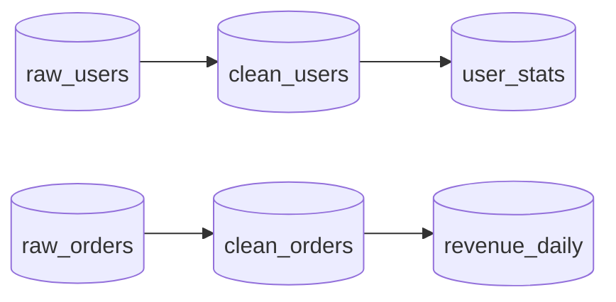
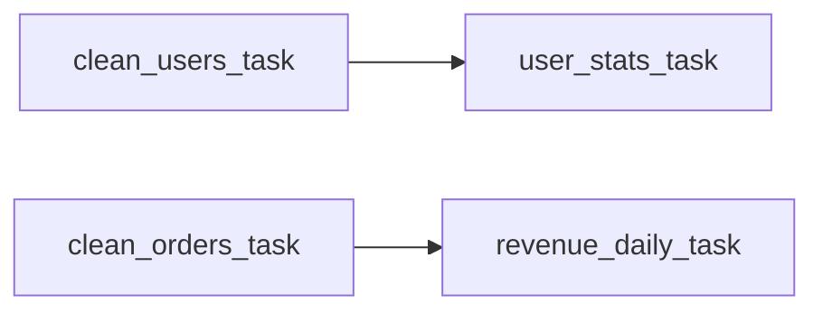
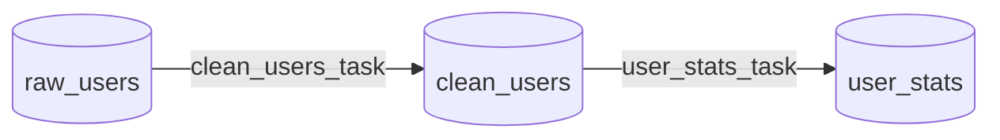
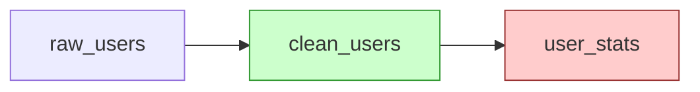

# duckOrch — DuckDB Orchestration + Lineage Extension

DuckDB の中で「DAG オーケストレーション + 自動リネージ + 可視化」を 1 拡張で完結させる。
SQLMesh 風のファイルフォーマット + Claude エージェント連携前提の CLI を備える。

## 実装ステータス (2026-05-02)

| Phase | 内容 | 状態 |
|---|---|---|
| 0 | プロジェクト骨組み(C++薄皮+Rust本体、ducksmiles流) | ✅ 完了 |
| 1 | タスクパーサ + DAG + 直列実行 | ✅ 完了 |
| 2 | optimizer フック自動リネージ | ⏸ 延期 (sqlparser-rs で代替可) |
| 3 | Mermaid 可視化(lineage/dag/combined) | ✅ 完了 |
| 4 | 失敗時 downstream skip + exp backoff retry | ✅ 完了 |
| 5 | 並列実行(topo layer + N std::thread) | ✅ 完了 |
| 6 | duck-orch CLI(register/run/status/graph/test/validate/impact/lineage/schedule)+ --json | ✅ 完了 |
| 7 | インクリメンタル(Jinja {{ var }} + 動的 watermark)+ @test | ✅ 完了 |
| 8 | スケジューラ(CLI daemon + cron) | ✅ 完了 |
| 9 | OpenLineage HTTP 発行(背景 worker、duck_lineage 互換) | ✅ 完了 |

検証済み: 4タスクの DAG パイプラインが PRAGMA / CLI 両方で動作、Mermaid 出力、並列実行、インクリメンタル差分、OL イベント送信、cron 登録すべて確認済み。

---

## 目次

1. [背景とゴール](#背景とゴール)
2. [アーキテクチャ](#アーキテクチャ)
3. [タスク定義フォーマット](#タスク定義フォーマット)
4. [CLI 設計](#cli-設計)
5. [SQL 関数 API](#sql-関数-api)
6. [状態管理](#状態管理)
7. [可視化](#可視化)
8. [失敗処理 / リトライ](#失敗処理--リトライ)
9. [インクリメンタル実行](#インクリメンタル実行)
10. [テスト / アサーション](#テスト--アサーション)
11. [並列実行](#並列実行)
12. [Claude / エージェント連携](#claude--エージェント連携)
13. [スケジューラ](#スケジューラ)
14. [duck_lineage との共存](#duck_lineage-との共存)
15. [開発ステップ (MVP→Pro)](#開発ステップ-mvppro)
16. [リスクと未解決事項](#リスクと未解決事項)
17. [参考実装](#参考実装)

---

## 背景とゴール

### 課題
- dbt + Airflow + Marquez を別言語・別プロセスで運用するのは重い
- DuckDB ユーザーは「単一ファイル + 単一コマンド」の体験を期待する
- AI エージェント(Claude 等)からパイプラインを生成・修正・実行できる設計が欲しい

### ゴール
- `LOAD duckorch;` 1 行で使える
- タスク = 1 SQL ファイル(SQLMesh 流ヘッダ付き)
- DAG・リネージ両方を**1 つの定義から**自動生成
- Mermaid と OpenLineage 両方で可視化
- 全 CLI コマンドに `--json` フラグでエージェントが parse 可能

### 非ゴール (MVP)
- 分散実行 (将来 DuckLake state で対応)
- Web UI (Mermaid と OpenLineage 互換で代替)
- Python/JS API (DuckDB SQL と CLI で十分)

---

## アーキテクチャ

### 「C++ 薄皮 + Rust 本体」サンドイッチ構成

DuckDB の C API は関数登録系のみで、optimizer / parser フックが未公開 (`duckdb_extension.h` 確認済、2026-05)。
クエリへの自動割り込みが必要なので C++ 拡張本体にし、ロジックは Rust に逃がす。
このビルド構成は DuckDB extension-template-rs を踏襲した一般的な形式(ducksmiles 等多くの拡張で採用)。

```
┌─────────────────────────────────────────────┐
│ C++ 薄ラッパー (~数百行)                    │
│  ・OptimizerExtension::pre_optimize 登録    │
│  ・LogicalOrchSentinel / PhysicalOrchSentinel│
│  ・ScalarFunction / TableFunction 登録      │
│  ・FFI で Rust 関数呼び出し                 │
└─────────────────────────────────────────────┘
                  ↕ extern "C" FFI
┌─────────────────────────────────────────────┐
│ Rust 本体                                   │
│  ・タスクファイルパーサ                     │
│  ・DAG 構築 / トポソート (petgraph)         │
│  ・SQL 解析で I/O 抽出 (sqlparser-rs)       │
│  ・状態管理 (DuckDB Connection 経由)        │
│  ・スケジューラ (cron + worker thread)      │
│  ・Mermaid 生成                              │
│  ・OpenLineage イベント生成                  │
└─────────────────────────────────────────────┘
```

### ディレクトリ構成

```
duckOrch/
├── DESIGN.md                          ← このファイル
├── CMakeLists.txt
├── Makefile                           ← ducksmiles 流
├── extension_config.cmake
├── vcpkg.json
├── Cargo.toml                         ← workspace
├── docs/                              ← 詳細 docs (後述)
├── src/                               ← C++ 薄皮
│   ├── duckorch_extension.cpp        ← entry, フック登録
│   ├── duckorch_extension.hpp
│   ├── orch_optimizer.cpp            ← PreOptimize, plan 解析
│   ├── orch_optimizer.hpp
│   ├── logical_orch_sentinel.cpp
│   ├── logical_orch_sentinel.hpp
│   ├── physical_orch_sentinel.cpp
│   ├── physical_orch_sentinel.hpp
│   ├── ffi_bridge.cpp                ← C++ ⇔ Rust 橋
│   ├── ffi_bridge.hpp
│   └── include/
│       └── duckorch.h                ← Rust 側 extern "C" 宣言
├── crates/                            ← Rust workspace
│   ├── orch_core/
│   │   ├── Cargo.toml
│   │   └── src/
│   │       ├── lib.rs                ← extern "C" exports
│   │       ├── task_parser.rs        ← @task ヘッダ解析
│   │       ├── dag.rs                ← petgraph トポソート
│   │       ├── lineage.rs            ← sqlparser-rs で I/O 抽出
│   │       ├── state.rs              ← DuckDB Connection 経由
│   │       ├── scheduler.rs          ← cron + worker
│   │       ├── executor.rs           ← タスク実行
│   │       ├── mermaid.rs            ← グラフ生成
│   │       └── openlineage.rs        ← OL イベント生成
│   └── orch_cli/                     ← duck-orch CLI
│       ├── Cargo.toml
│       └── src/main.rs
├── tasks/                             ← サンプルパイプライン
│   └── example/
│       ├── orch.toml
│       ├── clean_users.sql
│       ├── clean_orders.sql
│       ├── user_stats.sql
│       └── revenue_daily.sql
└── test/
    ├── unit/                          ← Rust unit
    └── e2e/                           ← Python pytest (duck_lineage 流)
```

### データフロー

```
┌──── タスクファイル ────┐
│ tasks/user_stats.sql  │
│ -- @task name=...     │
│ -- @inputs ...        │
│ -- @outputs ...       │
│ SELECT ...            │
└──────────┬─────────────┘
           │
           ▼ orch_load_directory()
   ┌───────────────────┐
   │ __orch__.tasks    │  ← Rust が parse + 保存
   └─────────┬─────────┘
             │
             ▼ orch_run_dag('pipeline')
   ┌───────────────────┐
   │ DAG 構築          │  ← Rust petgraph トポソート
   │ (循環検知)        │
   └─────────┬─────────┘
             │
             ▼ 各タスク順次実行
   ┌───────────────────┐
   │ Connection.Query  │  ← C++ 側で実行
   └─────────┬─────────┘
             │
             ▼ ★ Optimizer フック発火
   ┌───────────────────┐
   │ plan から I/O 抽出 │  ← C++ で plan 解析
   │ + 自動リネージ     │
   └─────────┬─────────┘
             │
             ▼ Sentinel デストラクタ
   ┌───────────────────┐
   │ Rust に通知        │
   │  ・runs 更新       │
   │  ・lineage 追記    │
   │  ・OL イベント発行 │
   └────────────────────┘
```

---

## タスク定義フォーマット

### 設計方針

- **1 タスク = 1 SQL ファイル**
- **メタ情報は SQL コメントに埋め込む**(SQL として valid 維持)
- **`-- @key value` または `-- @key=value` の単純なフォーマット**
- **YAML / TOML を別ファイルにしない**(乖離事故を防ぐ)

### 例: 必須フィールドだけ

```sql
-- @task name=user_stats
-- @outputs analytics.user_stats

CREATE OR REPLACE TABLE analytics.user_stats AS
SELECT country, COUNT(*) AS users
FROM analytics.clean_users
GROUP BY country;
```

`inputs` と `depends_on` は `sqlparser-rs` で SQL から自動抽出される。
ユーザーが書かなくて良い場合がほとんど。

### 例: 全フィールド

```sql
-- @task name=user_stats
-- @description 国別アクティブユーザー数
-- @owner data-team@example.com
-- @inputs analytics.clean_users
-- @outputs analytics.user_stats
-- @depends_on clean_users
-- @schedule "0 6 * * *"
-- @retries 3
-- @timeout 300
-- @incremental_by updated_at
-- @tags daily, analytics
-- @test "SELECT COUNT(*) FROM analytics.user_stats WHERE users < 0" expect 0

CREATE OR REPLACE TABLE analytics.user_stats AS
SELECT country, COUNT(*) AS users
FROM analytics.clean_users
WHERE updated_at > {{ last_run_at }}
GROUP BY country;
```

### サポートするヘッダフィールド

| フィールド | 必須 | 用途 |
|---|---|---|
| `name` | ✓ | タスク識別子(ファイル名から自動推定もする) |
| `description` | | 説明 |
| `owner` | | 担当者 |
| `inputs` | | 入力テーブル(自動抽出可) |
| `outputs` | ✓ | 出力テーブル |
| `depends_on` | | 明示的なタスク依存(通常 inputs から自動算出) |
| `schedule` | | cron 式 |
| `retries` | | リトライ回数(デフォルト 0) |
| `timeout` | | 秒(デフォルト無制限) |
| `incremental_by` | | インクリメンタル列 |
| `tags` | | グルーピング用 |
| `test` | | アサーション SQL |

### パイプライン全体設定 (orch.toml)

```toml
[pipeline]
name = "daily"
state_db = "default"  # default = 同じ DuckDB ファイル

[execution]
max_parallel = 4
default_retries = 0
default_timeout = 600

[lineage]
emit_openlineage = true
openlineage_url = "http://marquez:5000/api/v1/lineage"

[ai]
# Claude 連携時の補助
emit_explain_on_fail = true  # 失敗時にテーブル統計を JSON で出す
```

### バリデーションルール

- ファイル名と `name` が違う場合は警告
- 同名タスクが 2 ファイルにあったらエラー
- 自動抽出した inputs に存在しないテーブルがあったら警告(ただし他タスクの outputs にあれば OK)
- `outputs` に書かれていないが `CREATE TABLE` 文が存在したら警告
- DAG に循環があったらエラー(タスク登録時に検知)

---

## CLI 設計

### 原則

- **動詞 1 単語**(register, run, status, graph, validate, etc.)
- **全コマンドに `--json`** : エージェントが parse できる
- **ローカル実行は DuckDB ファイルに対して直接行う**(別プロセスのデーモン不要)
- **設定ファイル不要**(`./tasks/` ディレクトリと DuckDB ファイルだけで動く)

### コマンド一覧

```bash
# 登録
duck-orch register ./tasks/                      # ディレクトリ全部
duck-orch register ./tasks/user_stats.sql        # 1 ファイル
duck-orch unregister user_stats

# 実行
duck-orch run daily                              # パイプライン全体
duck-orch run daily --task user_stats            # 1 タスクだけ
duck-orch run daily --from user_stats            # ここから後続全部
duck-orch run daily --full-refresh               # 増分無視
duck-orch run daily --dry-run                    # 何が動くかだけ表示

# 状態
duck-orch status                                 # 直近 run 一覧
duck-orch status --task user_stats               # 履歴
duck-orch status --failed                        # 失敗のみ
duck-orch logs <run_id>

# 可視化
duck-orch graph daily --format mermaid           # Mermaid 標準出力
duck-orch graph daily --format json              # ノード/エッジ JSON
duck-orch graph daily --format html              # 自己完結 HTML 出力
duck-orch graph daily --output graph.md          # ファイル書き込み

# 検査
duck-orch validate ./tasks/                      # 構文 + 依存チェック
duck-orch impact analytics.clean_users           # この列を変更したら何が壊れる?
duck-orch lineage analytics.user_stats           # このテーブルの上流

# テスト
duck-orch test                                   # 全 @test 実行
duck-orch test --task user_stats

# スケジューラ
duck-orch schedule start                         # 背景デーモン起動
duck-orch schedule stop
duck-orch schedule list                          # 登録済み cron 一覧
```

### `--db` オプション

```bash
duck-orch --db mydata.duckdb run daily
```

省略時は `./mydata.duckdb` を探す → 無ければ作成。

### `--json` 出力例

```bash
$ duck-orch run daily --json
{
  "pipeline": "daily",
  "started_at": "2026-05-01T12:00:00Z",
  "tasks": [
    {"name": "clean_users", "status": "success", "rows": 12300, "elapsed_ms": 145},
    {"name": "user_stats",  "status": "success", "rows": 42, "elapsed_ms": 23}
  ],
  "finished_at": "2026-05-01T12:00:00.500Z",
  "status": "success"
}
```

エージェントは `jq '.tasks[] | select(.status == "failed")'` で失敗タスクを抜ける。

---

## SQL 関数 API

CLI と同じ機能を SQL からも呼べる(DuckDB 内のシェル/ノートブックから使うため)。

```sql
LOAD duckorch;

-- 設定
SET orch_state_schema = '__orch__';
SET orch_max_parallel = 4;
SET orch_openlineage_url = 'http://marquez:5000/api/v1/lineage';

-- タスク登録
CALL orch_load_directory('./tasks/');
CALL orch_load_file('./tasks/user_stats.sql');

-- 実行
SELECT * FROM orch_run_dag('daily');
SELECT * FROM orch_run_task('user_stats');

-- 状態
SELECT * FROM __orch__.tasks;
SELECT * FROM __orch__.runs ORDER BY started_at DESC LIMIT 10;
SELECT * FROM __orch__.lineage_edges;

-- 可視化
SELECT mermaid FROM orch_visualize('daily');
SELECT json FROM orch_visualize('daily', format := 'json');

-- 影響分析
SELECT * FROM orch_impact('analytics.clean_users');
SELECT * FROM orch_lineage_upstream('analytics.user_stats');
SELECT * FROM orch_lineage_downstream('analytics.raw_users');
```

---

## 状態管理

### スキーマ

すべて `__orch__` スキーマ配下(`SET orch_state_schema = '...'` で変更可)。

```sql
-- タスク定義(register 時に書き込む)
CREATE TABLE __orch__.tasks (
    name VARCHAR PRIMARY KEY,
    description VARCHAR,
    owner VARCHAR,
    sql VARCHAR NOT NULL,
    inputs VARCHAR[],
    outputs VARCHAR[],
    depends_on VARCHAR[],
    schedule_cron VARCHAR,
    retries INT DEFAULT 0,
    timeout_seconds INT,
    incremental_by VARCHAR,
    tags VARCHAR[],
    file_path VARCHAR,
    file_hash VARCHAR,
    registered_at TIMESTAMP DEFAULT CURRENT_TIMESTAMP
);

-- 実行履歴
CREATE TABLE __orch__.runs (
    run_id UUID PRIMARY KEY,
    pipeline_run_id UUID,         -- 同一 run_dag 内の親 run
    task_name VARCHAR,
    started_at TIMESTAMP,
    finished_at TIMESTAMP,
    status VARCHAR,                -- pending / running / success / failed / skipped
    rows BIGINT,
    error_message VARCHAR,
    error_stack VARCHAR,
    retry_count INT DEFAULT 0,
    last_processed_at TIMESTAMP   -- インクリメンタル用ウォーターマーク
);

-- リネージエッジ(タスク実行時に更新)
CREATE TABLE __orch__.lineage_edges (
    src_dataset VARCHAR,           -- catalog.schema.table
    dst_dataset VARCHAR,
    via_task VARCHAR,
    transform_type VARCHAR,        -- DIRECT / INDIRECT / AGGREGATE / etc.
    discovered_at TIMESTAMP DEFAULT CURRENT_TIMESTAMP,
    source VARCHAR,                -- declared / sql_parser / plan_extract
    PRIMARY KEY (src_dataset, dst_dataset, via_task)
);

-- カラムリネージ(オプション、後フェーズ)
CREATE TABLE __orch__.column_lineage (
    src_dataset VARCHAR,
    src_column VARCHAR,
    dst_dataset VARCHAR,
    dst_column VARCHAR,
    via_task VARCHAR,
    transform_type VARCHAR
);

-- スケジュール
CREATE TABLE __orch__.schedules (
    pipeline_or_task VARCHAR PRIMARY KEY,
    cron_expr VARCHAR,
    timezone VARCHAR DEFAULT 'UTC',
    enabled BOOLEAN DEFAULT true,
    last_triggered_at TIMESTAMP,
    next_trigger_at TIMESTAMP
);
```

### 状態保管先の抽象化

```
┌─ デフォルト: 同じ DuckDB ファイル
│  state_db = "default"
│
├─ 別の DuckDB ファイル
│  state_db = "/path/to/orch_state.duckdb"
│
└─ DuckLake (将来)
   state_db = "ducklake://my-catalog"
```

`crates/orch_core/src/state.rs` に `StateStore` trait を切って、後で差し替え可能にしておく。

---

## 可視化

### 方針: **Mermaid + OpenLineage の両立**

UI は自作しない。既存エコシステムに乗る。

| 出力 | ターゲット | 理由 |
|---|---|---|
| Mermaid | GitHub PR / VSCode / Claude | 軽量、テキスト、レビュー可能 |
| OpenLineage | Marquez / DataHub / Atlan | 業界標準、本格運用 |
| HTML 静的 | ローカル確認 | optional、Cytoscape.js 使用 |

### Mermaid 出力

#### グラフタイプ

**(1) リネージグラフ** = テーブル間の矢印

```sql
SELECT mermaid FROM orch_visualize('daily', mode := 'lineage');
```



**(2) DAG グラフ** = タスク間の矢印

```sql
SELECT mermaid FROM orch_visualize('daily', mode := 'dag');
```



**(3) 統合グラフ** = テーブル + タスク両方

```sql
SELECT mermaid FROM orch_visualize('daily', mode := 'combined');
```



**(4) 状態付きグラフ** = 直近 run の成功/失敗で色分け

```sql
SELECT mermaid FROM orch_visualize('daily', mode := 'lineage', with_status := true);
```



### OpenLineage 出力

duck_lineage と完全互換のイベントを emit する。

- `orch_run_dag` 開始時 = pipeline START イベント (`run_id` を pipeline_run_id として保持)
- 各タスク開始時 = task START イベント (`parent` facet に pipeline_run_id)
- 各タスク完了時 = task COMPLETE/FAIL イベント
- pipeline 完了時 = pipeline COMPLETE/FAIL イベント

```rust
// crates/orch_core/src/openlineage.rs
fn emit_event(event: OLEvent) {
    if let Some(url) = config.openlineage_url() {
        // duck_lineage の LineageClient と同じく非同期 worker に enqueue
        QUEUE.send(event);
    }
}
```

### duck_lineage との連携モード

ユーザーが `LOAD duck_lineage` も入れている場合、duckorch は **タスク内 SQL の OpenLineage 発行を duck_lineage に任せる**。
duckorch 側は pipeline 単位の親 run だけ発行し、子クエリは duck_lineage が拾う。

```rust
// 各タスク実行直前
std::env::set_var("OPENLINEAGE_PARENT_RUN_ID", pipeline_run_id);
std::env::set_var("OPENLINEAGE_PARENT_JOB_NAMESPACE", "duckorch");
std::env::set_var("OPENLINEAGE_PARENT_JOB_NAME", pipeline_name);
conn.execute(&task.sql)?;
```

これだけで Marquez UI 上で DAG 構造として見える。

### HTML 出力 (optional)

`duck-orch graph daily --format html --output graph.html` で 1 ファイル HTML を吐く。Cytoscape.js を CDN から読み込み、ノード/エッジ JSON を埋め込む。

---

## 失敗処理 / リトライ

### 失敗時の伝播ポリシー (dbt 流)

```
[clean_users] ──→ [user_stats] (失敗)──X→ [user_breakdown]  ← skipped
       │
       └─→ [revenue_daily]  ← 続行
```

- 失敗ノードの **downstream は skipped**(状態 = `skipped`)
- 独立した枝は続行
- パイプライン全体の最終状態 = 「全部成功」なら `success`、1 つでも失敗があれば `failed_with_partial_success` または `failed`

### リトライ戦略

```
@retries 3 のタスクが失敗
   │
   ├─ 1 回目失敗 → 2 秒待つ → リトライ
   ├─ 2 回目失敗 → 4 秒待つ → リトライ
   ├─ 3 回目失敗 → 8 秒待つ → リトライ
   └─ 4 回目失敗 → 諦めて failed
```

exponential backoff (`2^n` 秒)。`SET orch_retry_base_seconds = 2` で変更可。

### エラー詳細の保存

```sql
SELECT task_name, error_message, error_stack
FROM __orch__.runs
WHERE status = 'failed'
ORDER BY started_at DESC;
```

`error_stack` には DuckDB の例外メッセージ + Rust の panic 情報を入れる。

### Claude 連携: 失敗時の自動コンテキスト

`SET orch_emit_explain_on_fail = true` の場合:
- 失敗タスクの `EXPLAIN` 結果
- 入力テーブルの `DESCRIBE` と先頭 5 行
- 直近成功時との rows 差分

をまとめて `runs.error_context_json` に書く。Claude が「失敗を直して」と頼まれた時にこの JSON だけ読めば原因究明できる。

---

## インクリメンタル実行

### 基本モデル

`@incremental_by updated_at` を指定したタスクは、前回 run 以降の差分だけ処理する。

```sql
-- @task name=user_events
-- @outputs analytics.user_events
-- @incremental_by event_time

INSERT INTO analytics.user_events
SELECT * FROM raw.events
WHERE event_time > {{ last_processed_at }}
  AND event_time <= {{ now }};
```

### Jinja 風プレースホルダ

サポートする変数:
- `{{ last_processed_at }}` — 前回 run の `last_processed_at`(初回は `'1970-01-01'`)
- `{{ now }}` — 現在時刻
- `{{ run_id }}` — 今回の run_id

実装は単純な文字列置換 (`regex` または `minijinja` クレート)。

### `--full-refresh` フラグ

```bash
duck-orch run daily --full-refresh
```

- インクリメンタル状態を無視 → `last_processed_at = '1970-01-01'` として実行
- `CREATE OR REPLACE TABLE` 系のタスクは元から full、影響なし

---

## テスト / アサーション

### `@test` ヘッダ

```sql
-- @task name=user_stats
-- @outputs analytics.user_stats
-- @test "SELECT COUNT(*) FROM analytics.user_stats WHERE users < 0" expect 0
-- @test "SELECT COUNT(DISTINCT country) FROM analytics.user_stats" expect_gt 0

CREATE OR REPLACE TABLE analytics.user_stats AS ...;
```

### サポートするアサーション

| 形式 | 意味 |
|---|---|
| `expect 0` | 結果の単一値が 0 と等しい |
| `expect_gt N` | 結果 > N |
| `expect_lt N` | 結果 < N |
| `expect_empty` | 結果行数が 0 |
| `expect_non_empty` | 結果行数 > 0 |

### 実行

```bash
duck-orch test                  # 全タスクの @test を実行
duck-orch test --task user_stats
```

タスク実行直後に自動でテスト走らせるオプション:

```toml
# orch.toml
[execution]
test_after_run = true   # デフォルト false
```

失敗するとそのタスクは status = `test_failed`、downstream は skip。

---

## 並列実行

### 基本設計

DAG 上で互いに依存しないタスクは並列で動かす。

```
[clean_users]  [clean_orders]  [clean_events]    ← この 3 つは並列
       │             │              │
       ▼             ▼              ▼
   [user_stats] [revenue]      [event_agg]       ← これも並列
```

### Rust 側の実装

```rust
// crates/orch_core/src/executor.rs
fn run_dag(tasks: &[Task]) -> Result<()> {
    let pool = rayon::ThreadPoolBuilder::new()
        .num_threads(config.max_parallel())
        .build()?;
    
    let layers = topological_layers(tasks);  // 同時実行可能なタスクの層
    for layer in layers {
        pool.scope(|s| {
            for task in layer {
                s.spawn(|_| run_task(task));
            }
        });
        // 1 層終わるまで次に進まない
    }
    Ok(())
}
```

### DuckDB Connection の扱い

DuckDB は `Connection` がスレッドセーフではないので、各タスクで `db.connect()` で新しい接続を取る。`Database` 自体はマルチスレッド OK。

---

## Claude / エージェント連携

### 設計原則

「Claude が触りやすい形」を優先機能として最初から作り込む。

### 機能

#### (1) 全 CLI に `--json`
- 詳細は[CLI 設計](#cli-設計)を参照
- `jq` でパイプライン化できること

#### (2) スキーマ自己記述

```bash
duck-orch describe-format
```

→ タスクファイルの全フィールド仕様を JSON で出力。Claude のシステムプロンプトに食わせて「正しいフォーマットで生成して」と言える。

#### (3) `validate` コマンド

```bash
duck-orch validate ./tasks/new_task.sql --json
{
  "valid": false,
  "errors": [
    {"line": 1, "message": "Missing required field: outputs"},
    {"line": 5, "message": "Reference to undefined table: clean_userz (did you mean clean_users?)"}
  ]
}
```

Claude が生成 → validate → 修正 のループが回せる。

#### (4) `impact` コマンド

```bash
duck-orch impact analytics.clean_users --json
{
  "table": "analytics.clean_users",
  "downstream_tables": ["analytics.user_stats", "analytics.user_breakdown"],
  "downstream_tasks":  ["user_stats", "user_breakdown"]
}
```

「このテーブルのスキーマ変えたい、何が壊れる?」が一発で分かる。

#### (5) 失敗時の自動コンテキスト
- [失敗処理](#失敗処理--リトライ) の `error_context_json` 参照

#### (6) `MEMORY.md` 自動生成 (optional)

```bash
duck-orch describe-pipeline daily --format claude-md > tasks/CLAUDE.md
```

→ Claude Code の CLAUDE.md 形式でパイプライン全体の説明を生成。

---

## スケジューラ

### 実装

Rust の background thread で cron 式を評価。

```rust
// crates/orch_core/src/scheduler.rs
fn spawn_scheduler(state: StateStore) -> JoinHandle<()> {
    std::thread::spawn(move || loop {
        let now = chrono::Utc::now();
        let due = state.due_schedules(now);
        for sched in due {
            run_pipeline_async(sched.pipeline);
            state.update_next_trigger(&sched, next_cron(now, &sched.cron));
        }
        std::thread::sleep(Duration::from_secs(30));
    })
}
```

### CLI

```bash
duck-orch schedule start          # ファイルロックで多重起動防止
duck-orch schedule stop
duck-orch schedule list
duck-orch schedule add daily "0 6 * * *"
```

### DuckDB プロセス内モード

「DuckDB CLI を立ち上げっぱなしで使う」場合、拡張ロード時に scheduler thread を spawn するオプション:

```sql
SET orch_scheduler_enabled = true;
LOAD duckorch;  -- 自動で scheduler が動き出す
```

---

## duck_lineage との共存

### 想定シナリオ

1. **duckorch 単独**: タスク内 SQL のリネージは duckorch の plan 解析で取る
2. **duckorch + duck_lineage 両ロード**: タスク内 SQL のリネージは duck_lineage が OpenLineage に出す。duckorch は pipeline 構造だけ管理

### 衝突回避

duck_lineage を一緒にロードして使う場合、両者が独立した OpenLineage イベントを emit する。
duckOrch は pipeline_run_id を環境変数で渡し、duck_lineage 側でそのクエリを「duckOrch run の子」として記録する。

(duckOrch が将来 Phase 2 で自前 optimizer フックを実装した場合は、両者が plan を見ることになる。
 DuckDB は複数 OptimizerExtension の登録を許容するので、登録順に発火する。両者ともプラン読み取りのみで変更しない設計にしておけば衝突しない。これはテストで確認すること。)

---

## 開発ステップ (MVP→Pro)

### Phase 0: 環境構築 (1日)
- [ ] ducksmiles ディレクトリを参考に構成複製
- [ ] DuckDB submodule 追加
- [ ] CMake / Makefile / vcpkg.json
- [ ] Rust workspace (`crates/orch_core`, `crates/orch_cli`)
- [ ] FFI hello world (C++ から Rust 関数呼べるところまで)

### Phase 1: 最小ループ (1週)
- [ ] タスクファイルパーサ (Rust, `task_parser.rs`)
- [ ] `__orch__` スキーマ作成
- [ ] `orch_load_directory` table function (C++ → Rust)
- [ ] DAG トポソート (Rust, petgraph)
- [ ] `orch_run_dag` table function — 直列実行のみ
- [ ] `__orch__.runs` への状態書き込み

### Phase 2: optimizer フック + 自動リネージ (1週) [延期]
- [ ] `OptimizerExtension::pre_optimize_function` を独自実装で登録
- [ ] LogicalGet/Insert/CreateTable から I/O 抽出
- [ ] LogicalOrchSentinel / PhysicalOrchSentinel
- [ ] Sentinel デストラクタから Rust 通知 FFI
- [ ] `__orch__.lineage_edges` 自動更新

> **注意**: このフェーズを実装する場合は **scratch から独自実装する**。
> duck_lineage の同等機能はインスピレーションとして見るだけにとどめ、コードはコピーしない。
> 実装パターン(Sentinel + デストラクタで finalize)はソフトウェア工学の一般的手法で、特定プロジェクトの所有物ではない。

### Phase 3: 可視化 (1週)
- [ ] `mermaid.rs` 実装
- [ ] `orch_visualize` table function (lineage / dag / combined / with_status)
- [ ] `duck-orch graph` CLI

### Phase 4: 失敗処理 + リトライ (3日)
- [ ] downstream skip ロジック
- [ ] exponential backoff リトライ
- [ ] `error_context_json` (Claude 向け)

### Phase 5: 並列実行 (3日)
- [ ] rayon 統合
- [ ] DuckDB Connection per task
- [ ] e2e テスト

### Phase 6: CLI + Claude 連携 (1週)
- [ ] `duck-orch` CLI 全コマンド
- [ ] 全コマンドに `--json`
- [ ] `validate` / `impact` / `describe-format`

### Phase 7: インクリメンタル + テスト (1週)
- [ ] Jinja プレースホルダ置換
- [ ] `last_processed_at` 管理
- [ ] `@test` 実行
- [ ] `--full-refresh`

### Phase 8: スケジューラ (3日)
- [ ] cron 評価
- [ ] background thread
- [ ] `duck-orch schedule` CLI

### Phase 9: OpenLineage 統合 (3日)
- [ ] OL イベント生成
- [ ] duck_lineage 共存テスト
- [ ] Marquez での動作確認 (docker-compose)

### Phase 10: ドキュメント + リリース
- [ ] README
- [ ] tutorial
- [ ] DuckDB community extension 申請

---

## リスクと未解決事項

### 技術リスク

| 項目 | 影響 | 緩和策 |
|---|---|---|
| C++ 内部 API がバージョンアップで壊れる | High | submodule 固定、CI で複数バージョン test |
| optimizer フックが複数拡張で衝突 | Medium | 共存テスト充実 |
| FFI 境界の panic | High | `catch_unwind` 必須、Rust 側で全 panic を Result に |
| Sentinel デストラクタで例外 | High | 全 try/catch、`uncaught_exceptions()` 複数形を使用 |
| 並列実行で同じテーブル書き込み競合 | Medium | DAG が依存検出していれば衝突しない、ユーザー責任 |

### 未解決の設計判断

- [ ] `inputs` 自動抽出で view を深堀りするか?(duck_lineage は再パースで対応)
- [ ] DuckLake state store の優先度
- [ ] WASM ビルドサポートの可否
- [ ] Web UI を将来作るか?(DuckDB UI extension 統合か独立か)
- [ ] パイプライン定義に変数 (`{{ env.X }}` 等) を許すか?
- [ ] タスク間で値を渡す (XCom 相当) の必要性
- [ ] 外部システム連携(S3 アップロード、Slack 通知等)はプラグイン化?
- [ ] パッケージ管理(他人の作ったタスクライブラリを取り込む) — dbt packages 相当

---

## 参考にしたプロジェクト(コードはコピーしていない)

duckOrch のコードはすべて scratch から書きました。下記は**設計の参考にしただけ**で、コード自体の流用はありません。

| プロジェクト | ライセンス | 何を参考にしたか |
|---|---|---|
| [duck_lineage](https://github.com/ilum-cloud/duck_lineage) | MIT | OpenLineage 互換イベントを DuckDB から emit する**設計上のアイデア**(具体的なオーケストレーション機能とは独立)。HTTP worker thread + queue は標準的なパターン。 |
| [ducksmiles](https://github.com/duckdb/community-extensions/tree/main/extensions/ducksmiles) | MIT | C++ + Rust ハイブリッド拡張の **CMake / Makefile / vcpkg ビルド構成**。同じ extension-template-rs ベースの定石形式。 |
| [SQLMesh](https://sqlmesh.readthedocs.io) | Apache-2.0 | タスクファイルフォーマット(`MODEL(...)` ヘッダ)の**書き味**を真似た。SQLMesh 自体は依存していない。 |
| [dbt](https://docs.getdbt.com) | Apache-2.0 | テストアサーション、タグ、failed downstream skip、`--full-refresh` などの**運用パターン**。 |
| [OpenLineage](https://openlineage.io) | Apache-2.0 | 公開仕様。誰の所有物でもなく、互換イベント形式に従っているだけ。 |

### 著作権・帰属について

- duckOrch のソースコードはすべて新規執筆
- ライセンスは MIT(LICENSE 参照)
- OpenLineage 互換は仕様遵守であり、特定実装の派生ではない
- duck_lineage と互換性があるのは、両者が同じ公開仕様(OpenLineage)に従っているからで、コード由来ではない
